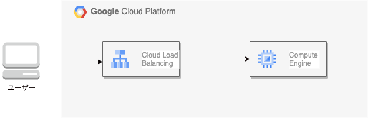

# GCP Compute Engine にロードバランサーを接続する

このプロジェクトでは、Terraform を使用して GCP の Compute Engine に HTTP ロードバランサーをデプロイします。

<p align="center">
  
</p>

## デプロイ内容

+ Compute Engine インスタンス
+ インスタンスグループ
+ HTTP(S) ロードバランサー
+ ヘルスチェック
+ ファイアウォールルール

# 起動方法

### 1. 環境ごとのtfvars作成

```
bin/make_tfvars
```

### 2. Terraform の適用

```
bin/terraform_apply
```

### 3. デプロイの確認

Terraformの出力で示されたURLをブラウザで開き、Nginxのデフォルトページが表示されることを確認してください。

### 4. Terraform の削除

```
bin/terraform_destroy
```
